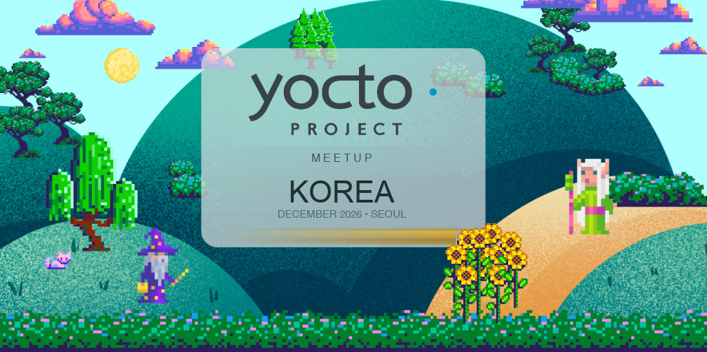

# Yocto Project Meetup Korea 2026

한국 임베디드 리눅스 및 Yocto Project 엔지니어들을 위한 기술 교류 및 네트워킹 밋업 공식 GitHub 페이지입니다.

🌐 **공식 웹사이트**: [https://meetup.yocto.co.kr](https://meetup.yocto.co.kr)

---

## 📌 행사 개요 (Overview)

> **상태**: 🚧 **준비 중 (WIP)** - 세부 일정 및 장소 조율 중

- **일시 (Date)**: 2026년 12월 5일 (토) 오후 / Saturday, December 5, 2026 (Afternoon) *(잠정 예정)*
- **장소 (Venue)**: OpenUP (오픈UP 소프트웨어센터, 서울) *(협의 및 준비 중)*
- **규모 (Scale)**: 오프라인 약 50명
- **참가비 (Fee)**: 무료 (Google Forms 사전 등록제)

---

## 🎙️ 발표 세션 (Schedule)

각 세션은 **20분 발표 + 10분 질의응답(Q&A)** 으로 진행되며, 발표 종료 후 **1시간 동안 자유로운 오픈 네트워킹**이 진행됩니다.

| 구분 | 발표자 (Speaker) | 소속 (Affiliation) | 발표 주제 (Topic) | 시간 |
| :---: | :--- | :--- | :--- | :---: |
| **Talk 1** | **배창혁** (Changhyeok Bae) | Mercedes-Benz Innovation Lab | *주제 조율 중 (TBA)* | 20m + 10m Q&A |
| **Talk 2** | **손현수** (Hyunsu Son) | LG전자 (LG Electronics) | *주제 조율 중 (TBA)* | 20m + 10m Q&A |
| **Talk 3** | **양동현** (Donghyun Yang) | LG전자 (LG Electronics) | *주제 조율 중 (TBA)* | 20m + 10m Q&A |
| **Talk 4** | **모우진** (Woojin Moh) | 오픈소스 커뮤니티 | *주제 조율 중 (TBA)* | 20m + 10m Q&A |
| **Social** | **오픈 네트워킹 & 교류** | 모든 참석자 | 다과/음료 및 자유 기술 교류 | ~60분 |

---

## 🤝 스폰서십 후원 안내 (Sponsorship)

Yocto Project Meetup Korea의 원활한 운영 및 커뮤니티 활성화를 위해 기업/기관 스폰서 및 파트너를 모집하고 있습니다.
- 문의: `sponsor@yoctoproject-korea.org` 또는 GitHub Issues
